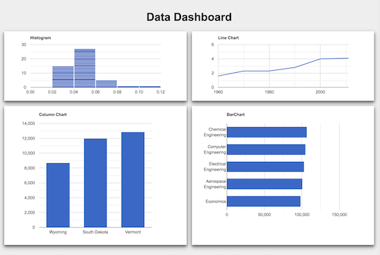

# The Challenge

Identify a problem to investigate using data collection and visualization techniques. Provide new insight into the problem and inspire action by your target audience. Dig deep and understand the context of the problem and the people it affects.

## Final Deliverables

* **A Web-based Dashboard Visualization** - We will primarily use [Google Charts](https://developers.google.com/chart/) and [alaSQL](http://alasql.org/)
* **Poster** - Summarize key activities and artifacts of your team's process.
* **Video** -Demonstrate your dashboard and explain the value it provides.
* **Public Presentation** -  A poster session where you will both demonstrate your dashboard and explain your team's process to the public.

## Skill Building

Complete the following code tutorials at your own pace at a minimum throughout the project duration. Earlier is better.

* SQL - [Kahn Academy SQL](https://www.khanacademy.org/computing/computer-programming/sql)
* Spreadsheets - [Spreadsheet Tutorials \(8-16\)](http://www.gcflearnfree.org/googlespreadsheets/)​

## Copyright and License

Copyright © 2018-2019 Jim Lyst and Michael Frontz, Indiana University School of Informatics and Computing at IUPUI

This material is part of the [Computing by Design](https://docs.idew.org/the-cxd-framework/) high school computer science curriculum developed for the [Informatics Diversity-Enhanced Workforce \(iDEW\)](http://soic.iupui.edu/idew/) program, an award-winning community partnership in central Indiana that is broadening student participation in computing and helping students develop the skills essential for success in the 21st century workplace. The iDEW program is managed by the [Indiana University School of Informatics and Computing at IUPUI](https://soic.iupui.edu/).

This work is licensed under a [Creative Commons Attribution-NonCommercial-ShareAlike 4.0 International License](http://creativecommons.org/licenses/by-nc-sa/4.0/). You are free to use, share, or adapt this material for non-commercial purposes as long as you provide proper attribution and distribute any copies or adaptations under this same license.

​[​​](http://creativecommons.org/licenses/by-nc-sa/4.0/)​

