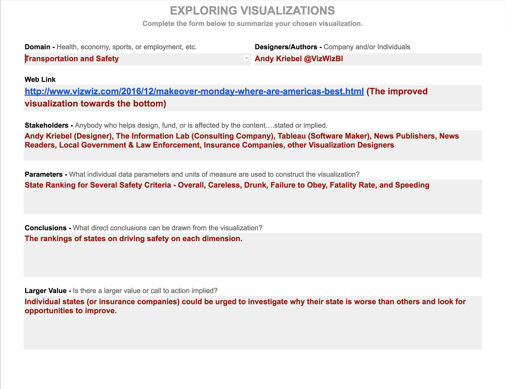

# 1-1 Exploring Visualizations

For this exercise you will explore visualizations online and to see the breadth of approaches and domains that visualization is applied. You will then select one visualization to analyze and share it with the class. Let's get some [inspiration from Hans Rosling](https://youtu.be/hVimVzgtD6w?t=2m29s).



**Instructions**

1. Explore visualizations at sites like [flowingdata.com](https://flowingdata.com/), [Information is Beautiful](http://www.informationisbeautiful.net/), and [fivethirtyeight.com](http://fivethirtyeight.com/). Look for "information rich" examples that demonstrate a skillful use of visualization to convey some complex data. Do your own internet search for more visualization examples and galleries, like [this](https://www.maptive.com/17-impressive-data-visualization-examples-need-see/) and [this](https://blog.hubspot.com/marketing/great-data-visualization-examples#sm.000010salgspwqfi8r53m1glwg4x7).
2. Choose one visualization to analyze and record the items below in a document. Use [this template](https://docs.google.com/document/d/1276ufg4SrhtsCNJRJaZaPEl0mV8tSz1RT37cvFpxzEs/edit?usp=sharing) if you would like.
   * Domain of the Visualization - Health, economy, sports, or employment, etc
   * Designers/Authors of the Visualization - Company and/or Individuals
   * Web Link to the Visualization
   * Stakeholders - Who is the content designed for? And who helped design or fund the content.
   * Conclusions - What direct conclusions can be drawn from the visualization?
   * Value - What is the value? Is it meant to call people to some action? Why will people care?

**❏ Deliverable: Your Analysis Document** - Be prepared to share what you found most compelling about the visualization and your analysis.

**Example**

