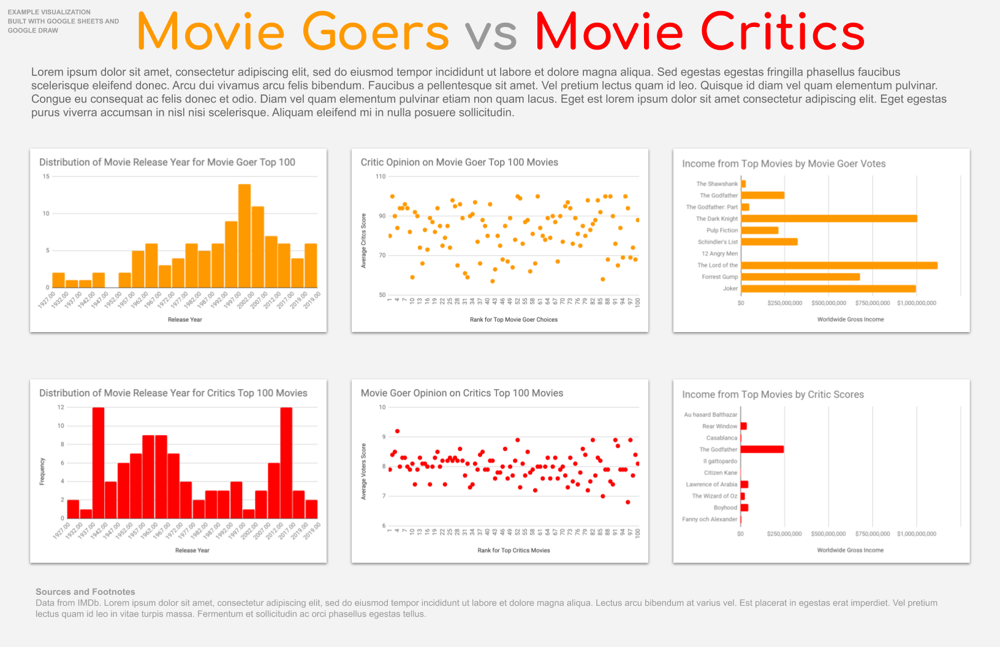

# A - Spreadsheet Exercises

_Objective: Experience how to import CSV data into a spreadsheet, create charts from the data and compose the charts into a visualization document._   
  
Your goal for this exercise is to create a visualization that looks something like the exampled below. You will start with the same data and use Google Sheets to create the charts. You can then copy and paste charts into Google Drawing to create a refined composite of the charts. 





**Instructions**

1. Import the two CSV files above into Google Sheets.
2. Create histograms of the "year" column for each dataset.
3. Create a scatterplot comparing the "rank" and "metascore" for the movie-goer dataset. Similarly create a scatterplot comparing the "rank" and "avg\_vote" for the critics dataset.
4. Create a bar chart of the "worldwide\_gross\_income" for the top 10 movies of each dataset.
5. Start a Google Drawing and set the page to 17" wide by 11" tall.
6. Copy and paste your charts from Google Sheets into your drawing and resize as needed.


Check back soon for more.


