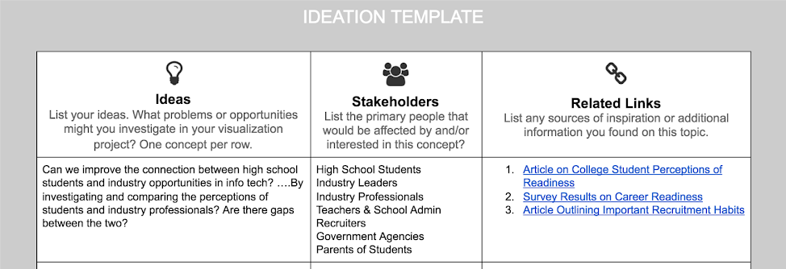
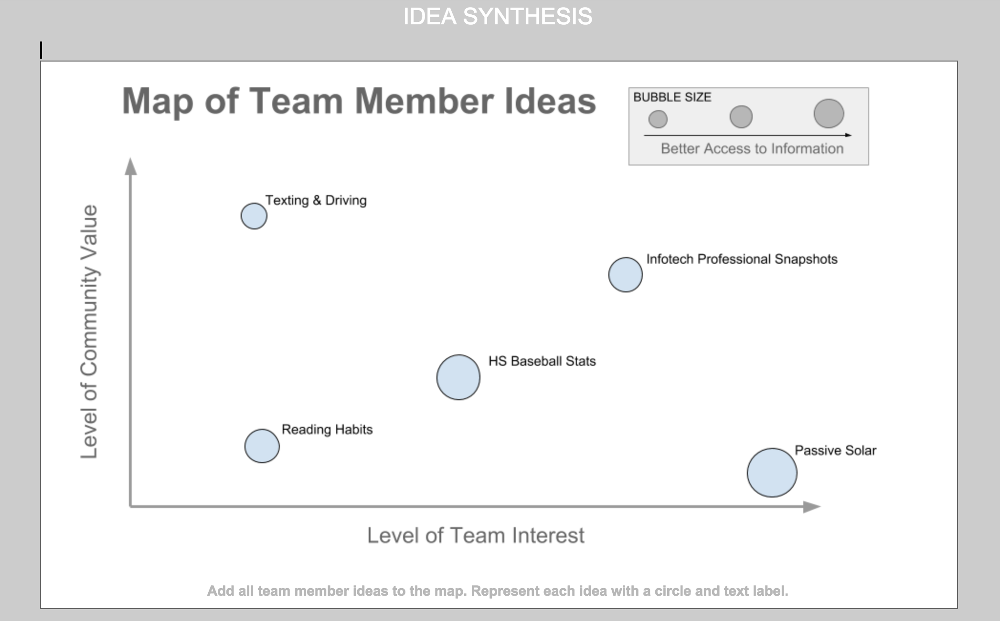

# 1-3 Concept Ideation

1. **As individuals, develop your own set of ideas and concepts** that your team will review before selecting a final path. You want to come up with many diverse ideas without worrying too much about details. List _at least_ 5 concepts. For each concept list the likely stakeholders and include 3 links to related concepts, data, or information on the web. [Here is a template](https://docs.google.com/document/d/1kyEtCisRY0_TvtrKnwQZD4vFL6kse6ksaDTl1QJDkIk/edit?usp=sharing) you can use.
2. **Next, gather your team and provide every member an opportunity to share ideas.** It is important that you listen to all ideas and fully consider them.
3. **Select the top 6 ideas from the team and compare them based on three criteria.** You can use [this chart](https://docs.google.com/document/d/1W7puWtontu0NpCge_FjfjBkzEx88_DlsNzwCB-MYUuA/edit?usp=sharing) to visualize your concepts.
   * What is the potential level of community impact or value of the idea?
   * What is the team's level of interest in the concept topic?
   * How much access do you have to the needed data/information that you expect your will need?

**❏ Deliverable:** Documentation of individual concepts and a map of your concept comparisons.

**Examples**

