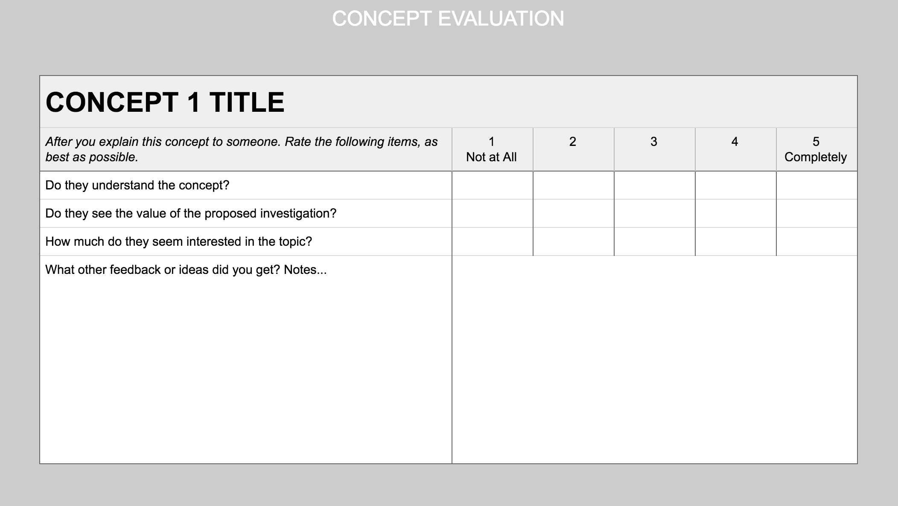
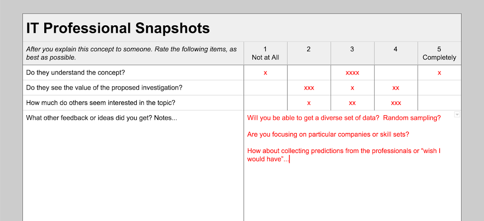

# 1-4 Concept Evaluation

1. **Get feedback from two other teams in your class** by explaining each concept and getting feedback on each of the following criteria.
   * Do they understand the concept?
   * Do they see the value of the proposed investigation?
   * How much do they seem interested in the topic?
   * What other feedback or ideas did you get? 
2. **Then, outside of class, ask for 3 people's feedback on each concept using the same criteria.** So a team of 3 should get a total of 9 \(at least\) individuals' feedback outside of class. Try to get quality feedback from each of your target stakeholders. Coordinate with your team who will target each key group. 

You can use [this template](https://docs.google.com/document/d/13UlOANdYPz2Zzz3rahvB3423RVnLHfhhPdFFWHgcESc/edit?usp=sharing).

**❏ Deliverable:** Document containing all evaluation results.

**Example**

