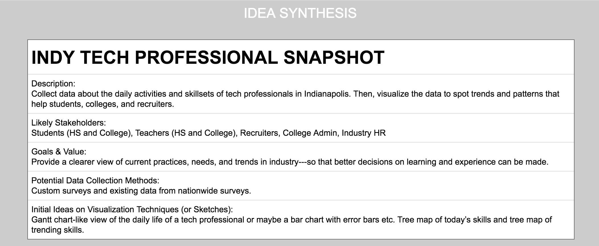
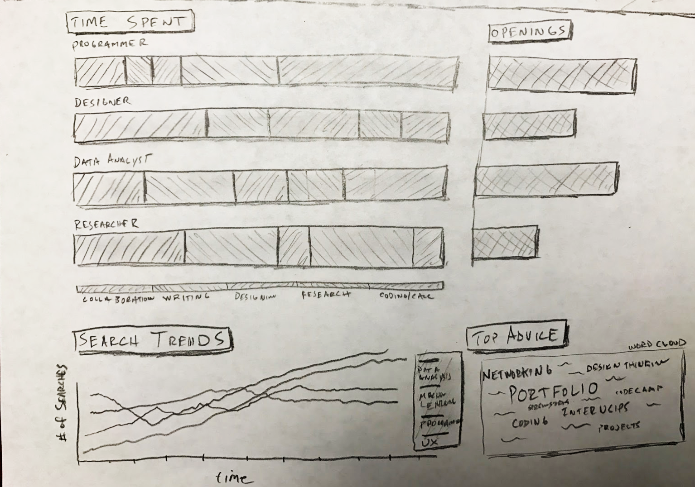
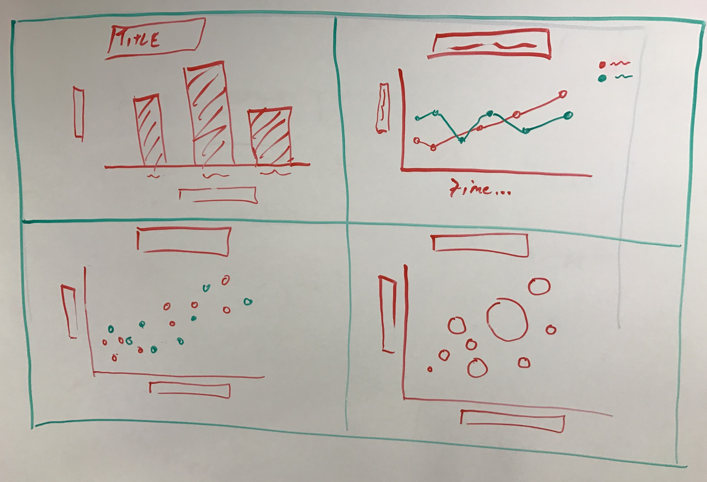

# 1-4 Concept Selection and Sketches

1. **Narrow down your team concepts to the top three**.
2. **Complete the following details for each concept.** You can use [this template](https://docs.google.com/document/d/1q8GrkOk40KiU47JYBdZOsisdYwBYWD-02eguFwuemaM/edit?usp=sharing).
   * Description
   * Stakeholders
   * Value
   * Potential Data Collection Methods
   * Initial Ideas and Sketches on Visualization Techniques

**❏ Deliverable:** Document containing three concepts.

**Examples**

