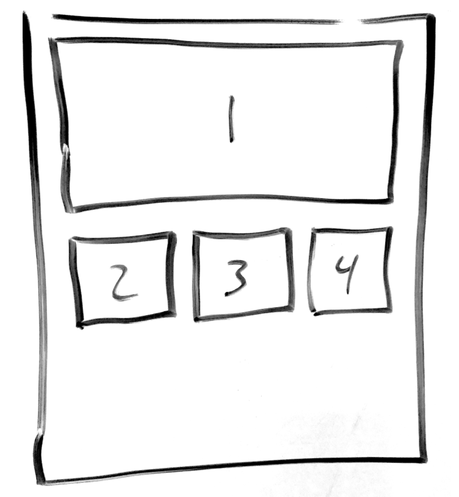

# 2-1 Define Layout and Visual Elements

The building blocks of your visualization dashboard are individual charts and visuals. You will now _\*\*_conceptualize the details for each of these building blocks that will support your proposal and value statement. Begin by describing six or more visual elements that may end up being in your dashboard.


This might be a good time to use visual techniques for thinking [like Dan Roam provides](http://digitalroam.typepad.com/photos/uncategorized/2008/08/05/6x6.jpg). These concepts may help your team think about how different visuals can help answer _who, what, what, where, and when_ types of questions.


## Instructions

Outline the following for at least six potential visual elements \(e.g. charts\) in your dashboard,. There is no particular order to this outline, because each description co-evolves. Just start with what makes sense for you.

* **What type of visual may be used for this element?** Precisely describe and sketch the type of visual intended \(e.g. bar chart\), including what data goes on what axis. Use [this resource](https://cdn2.hubspot.net/hub/53/file-863940581-pdf/Data_Visualization_101_How_to_Design_Charts_and_Graphs.pdf) \(starting on slide 4\) to guide you in selecting a type of visual. Sketch out each visual with enough detail to help your team discuss and plan design choices. Include axis labels. Take photos of your sketches to document as needed.
* **Why is this visual element valuable?** Describe how this particular element supports your value statement in your proposal. What important questions does it help answer? You are building a more detailed explanation of your value statement with each visual element.
* **What data is needed for this visual element?** Describe the data needed to make the visual element, along with appropriate units of measure. You can think of this as the column labels of a data table you will need to create the visual.
* **What are the likely sources of your data?** List the potential sources of information for each element. Do a thorough internet search for existing sources as needed. Your source may also be a future survey or interviews you conduct.

## **❏ Deliverable**

**A document or spreadsheet the outlines the the items above for each potential visual element of the dashboard.**

[Optional Template](https://docs.google.com/spreadsheets/d/1aYThzxiUXE02LuRFytHkQeYbschEyCFJKDF1LwFAMrY/edit?usp=sharing)

