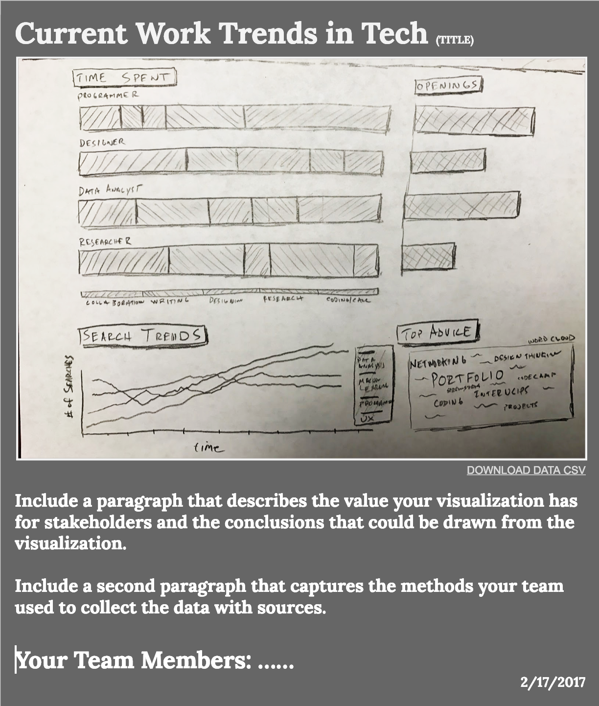

# 2-3 Prototype


Keep in mind that your prototyping will co-evolve with your team's data collection planning.


## Instructions

### 1. Create at least three prototypes for your team's dashboard

Each prototype can be mixed-media, like the example above, where you use a sketch embedded in a Google document to represent what your dashboard may look like.

Each prototype should contain the same elements your final dashboard will have.

* **A title.**
* **The dashboard visuals.** This can be a neatly done sketch or charts created by a digital tool like a spreadsheet.
* **A link \(fake at the moment\) to how you will share your data.** Don't worry about including any current data you have.
* **A paragraph or two** that clearly describes the methods your team used, the value the visualization has to stakeholders, and any conclusions your team can claim from the data analysis. For your prototypes this will simply be a draft description.
* **A listing of team members and your school.**
* **Date**.

Style the page as you like, but don't worry too much about style and color. Focus on clarity and content.

### 2. Determine Feedback Prompts

Before you get feedback on your prototypes, determine how you will prompt participants to give you feedback. This will be a flexible script to ensure you get useful results. Here is a recommended outline to begin the process. Adapt it to your needs.

* Briefly explain the background of your class project to the participant and that you are looking for feedback on your prototype before you begin full development.
* Ask the participant to study your prototype for a moment. Give them some time to look at it. \(This is why a clear and legible prototype is important.\)
* Ask the participant what they believe the purpose of the visualization would be and what important information might somebody learn from it. Let the participant know that you are not quizzing them, but trying to ensure the design is self-apparent in its purpose. Allow the discussion to go where it leads without taking too much time.
* Ask the participant if they have any other ideas or insights to improve with your project.
* Thank her or him for participating in the evaluation and let them know how they can see your team's final work later.

### 3. Collect Feedback In and Out of Class

Get feedback from classmates outside of your team to check for any obvious problems, then each team member should get feedback from at least 2 people outside of class on your prototypes. Be prepared to outline and discuss the feedback received.

## **❏ Deliverables**

Document your team's prototypes and the summary of feedback.

[Example Prototype](https://docs.google.com/document/d/15Y0Er8GsPw7TLeYtoo8zwFv8dMPlmPu2012476MLGRc/edit?usp=sharing)

