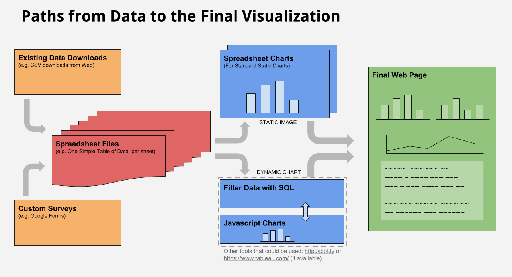

# 2-4 Development

Now that you have a clear design target for the data and visualization, it's time to determine a simple plan for development. The following three activities are a good way to divide up tasks and responsibilities.

## Instructions

### 1. Verify your team member roles and responsibilities for development.

* **Data Collection** - Your team should already have some good data downloaded and you may have surveys ready to go from your earlier planning. You will still want to consider new online searches or surveys as your team learns more during development. A large part of your time will be refining, testing, and executing your surveys. You will want to ensure that all data is in a usable format for programming the visualizations.  
* **Programming** - There are different paths you could take to programming your visualization and you may actually want to mix your methods. For example, you could create static charts in Google sheets and export them as a .png image file and insert them with HTML in your final web page. But for dynamic and custom visualizations, you will want to work in Javascript using the [template and code examples](https://docs.idew.org/code-dataviz-dashboard/) as a starting point. Carefully consider your options.  
* **Design Style and Writing** - The style and writing for your visualization should not be taken lightly. Carefully develop a style \(colors, fonts, layout, etc.\) that is clear, engaging, and reflects the purpose of your work. While you will aim for creating only two or three paragraphs of text as part of your visualization, you want the writing to also be very clear, engaging, and fully reflect the purpose of your work. Do several iterations for improvement. You will also be responsible for the clarity of labels and annotation in your visualizations.

### 2. Team Planning

Once you have determined who will take what roles, discuss the first steps each team member will take in the development and how you will collaborate along the way.

