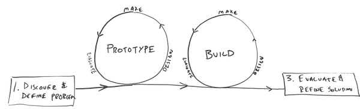

# 2 Design & Build Solution

**Design a prototype** of the solution for a detailed internal review and evaluation by a sample of stakeholders. Based on what you learn from your prototype, organize a development strategy to methodically **collect data, program, and style your solution** with efficiency and quality. Also prepare for the promotion and launch of your solution, and conduct unit testing to ensure all is in working order before an in-class demonstration.

