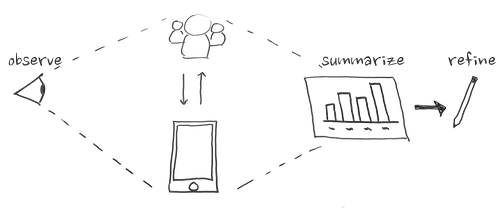

# 3 Evaluate & Refine Solution

After confirmation of the solution’s quality, launch and promote the work. Monitor the use of your solution and gather direct feedback from key stakeholders for minor improvements or document recommendations for further development.

