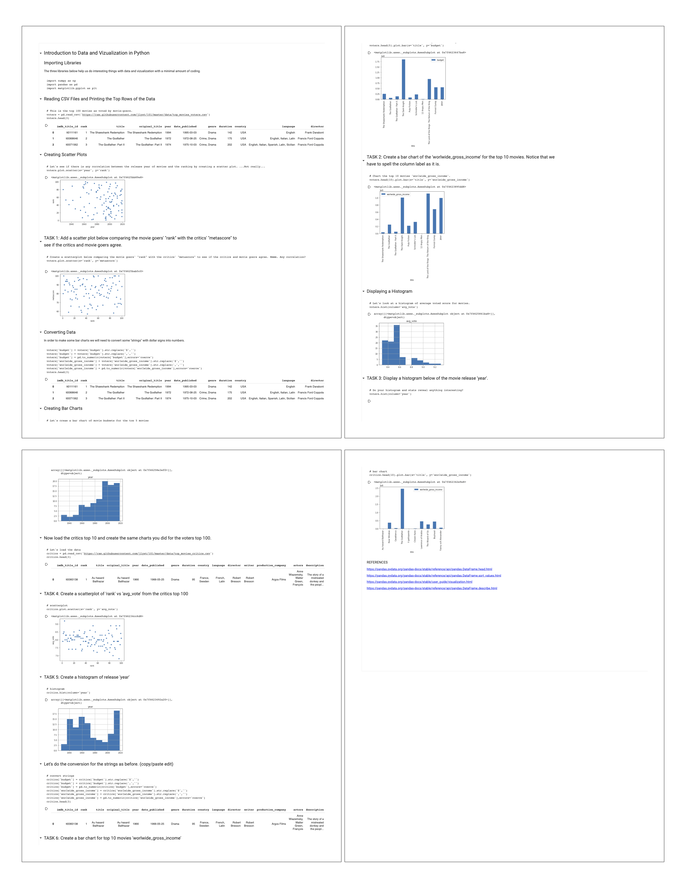

# Data Viz with Python Exercise

_Objectives: Experience how to import CSV data into a Python Notebook and create charts from the data, similar to what was done in the spreadsheet exercise.  Develop an understanding of how Python Notebooks work to document and execute code._  
  
Your goal for this exercise is to complete items in a template Python Notebook to import CSV data and produce several charts .  The resulting document will look something like the image below.



This exercise is partially a tutorial with some copy/paste/edit tasks to build an intuition of how python notebooks work and can be used to process data. We will create charts from movie datasets, similar to the spreadsheet exercise.

#### **Instructions \(see** [**Video Explanation**](https://drive.google.com/file/d/1ktXwEnjMjqwhvNttXeF0v_gyO_s16SVT/view?usp=sharing)**\)**

1. Create your own copy of [this Python Notebook](https://colab.research.google.com/github/jlyst/101/blob/master/data/Movie_Data_Lab.ipynb) in your google drive.
2. Follow along in each step of the notebook and complete the TASK items.
3. Once complete, print the notebook as a PDF and submit your PDF file.

#### **Deliverable**

A PDF of the completed notebook.

> _NOTE: Getting Images of Charts_
>
> If you needed to get images of your charts from the notebook for use in another application, like Google Drawing, you could do one of two things. 
>
> 1. You could screen capture a copy of a chart and paste it as an image into another application. 
> 2. You could download a PNG file directly from the Python Notebook \(Colab on Google Drive\) using a code block like the following and insert that image in the other application.
>
>    ```python
>    voters.plot.scatter(x='rank', y='metascore')
>    plt.savefig('scatterplot.png')
>    from google.colab import files
>    files.download( "scatterplot.png" )
>    ```

